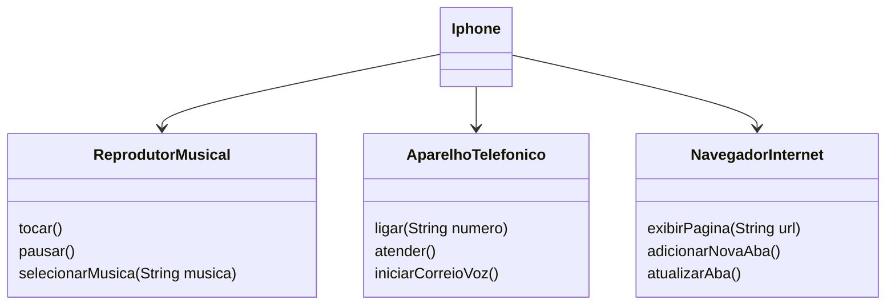

# Projeto
Segue abaixo o UML do projeto proposto:

```mermaid
classDiagram
Iphone --> ReprodutorMusical
Iphone --> AparelhoTelefonico
Iphone --> NavegadorInternet
ReprodutorMusical : tocar()
ReprodutorMusical : pausar()
ReprodutorMusical : selecionarMusica(String musica)
AparelhoTelefonico : ligar(String numero)
AparelhoTelefonico : atender()
AparelhoTelefonico : iniciarCorreioVoz()
NavegadorInternet : exibirPagina(String url)
NavegadorInternet : adicionarNovaAba()
NavegadorInternet : atualizarAba()
```

